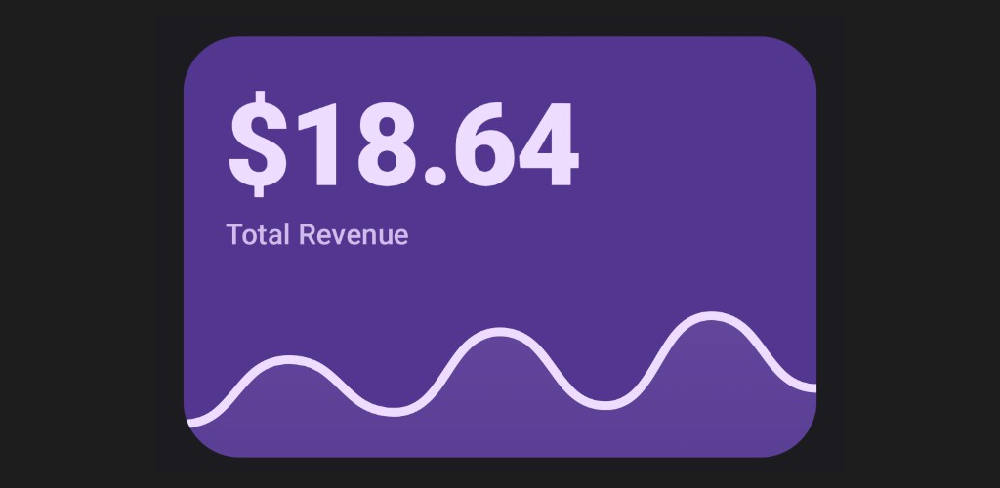
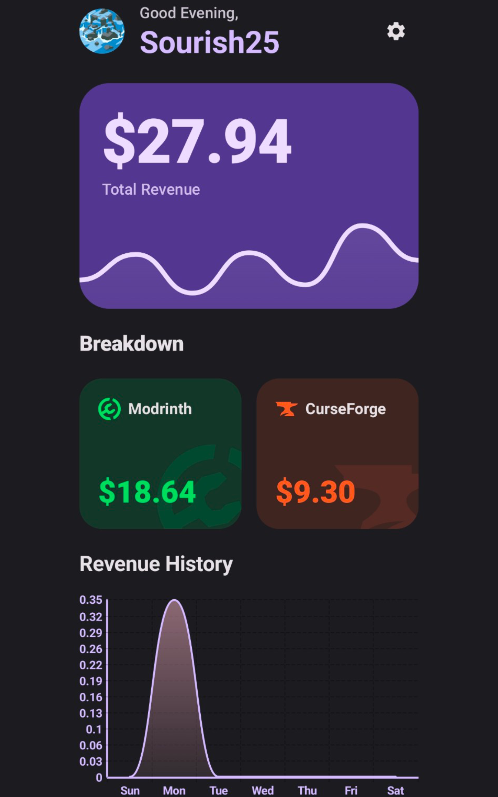
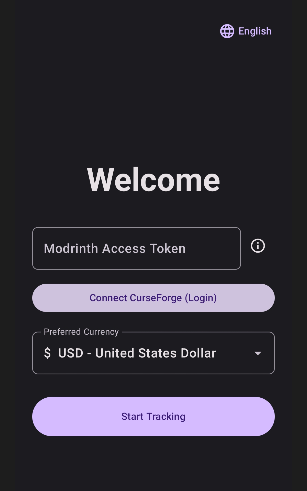

# MineBucks

  
  <h1>MineBucks</h1>
  
<strong>Comprehensive Revenue & Analytics Tracker for Minecraft Mod Creators</strong>

  
  

    
    
    
    
     
    
    
    
    
  

  

---

## 🚀 Overview

**MineBucks** is an open-source Android utility developed to solve the fragmentation of revenue tracking in the Minecraft modding ecosystem. It automates data retrieval from **Modrinth** and **CurseForge**, providing a unified dashboard for creators to monitor their earnings without manual aggregation.

> "A Set and Forget solution that runs silently in the background."

---

## ✨ Features Showcase

### 📊 Unified Dashboard

Aggregates data from both platforms into a single view. No more Excel sheets or mental math.

  

 

### 📈 Deep Analytics & Visualization

Visualize your revenue trends with beautiful, interactive graphs. Track daily performance effortlessly.

  

 

### 🌐 Smart CurseForge Integration

Includes a secure, built-in browser engine to authenticate with CurseForge safely. Bypasses standard login blocks while keeping your credentials local.

  

 

### ⚡ Easy Setup & Customization

Configure your preferred currency, notifications, and refresh intervals in seconds.

  
  

---

## 1. Project Origins & The Problem

As active mod developers in the Minecraft community, we faced a recurring daily inefficiency. Every morning involved a manual workflow:

1. Navigate to the Modrinth dashboard to check balance.
2. Navigate to the CurseForge Authors portal to check Reward Points.
3. Manually sum the totals.
4. Perform currency conversion (USD/Points to Your Country's Currency) to understand actual earnings.

This repetitive process was inefficient and lacked historical data tracking. We attempted to find existing solutions, but none offered the passive, unified monitoring we required. Thus, MineBucks was architected to utilizing Android's WorkManager to fetch, aggregate, and notify us of financial changes.

---

## 2. Engineering Journey & Technical Challenges

Developing MineBucks revealed significant gaps in the available public APIs for both major platforms.

### 2.1. The Modrinth API Dilemma

Our initial approach was to strictly use the official Modrinth API. However, we encountered severe versioning inconsistencies:

* **API v1 & v2**: Documentation suggested endpoints for user revenue, but in practice, these returned consistent `404 Not Found` errors or were deprecated without replacements.
* **API v3**: While stable for public statistics (downloads, checking project status), it restricts financial data. We eventually found a method to retrieve the "Total Wallet Balance", but granular data (daily income history) remains inaccessible via the public API.

**Current Implementation**: We utilize a hybrid approach, using API v3 for project data and a secure, authenticated scraper for financial details that the API omits.

### 2.2. The CurseForge "Black Box"

CurseForge proved even more challenging. The platform provides **no public API endpoint** for retrieving a user's current "Reward Points" balance. The data is strictly server-side rendered on the Authors Dashboard.

**The Solution: On-Device Scraping engine**
To retrieve this data without violating user trust (i.e., asking for passwords), we built a custom Web Scraping Engine within the app:

* **Internal Browser**: We embedded a WebKit WebView that acts as a portal to `authors.curseforge.com`.
* **Google Login Bypass**: CurseForge uses Google OAuth. Standard WebViews are blocked by Google ("This browser or app may not be secure"). We engineered a workaround by dynamically injecting a specific Mobile User-Agent string during the login phase, tricking Google's security checks into allowing the authentication flow.
* **DOM Injection**: Once the dashboard loads, the app injects a JavaScript payload to search the DOM for the specific `div` containing the reward points integer.

---

## 3. Other Implemented Features

* **Background Synchronization**: Uses Android WorkManager to fetch data every 6 hours (Network Dependent).
* **Battery Efficiency**: Designed to respect Android Doze mode. The app consumes 0% battery when idle.
* **Smart Notifications**: You are only notified if your revenue *increases*.
* **Privacy-First**: All tokens and cookies are stored locally using `EncryptedSharedPreferences`. No data is ever sent to our servers.

---

## 4. Usage Guide (Step-by-Step)

### Step 1: Modrinth Configuration

**How to generate a PAT:**

1. Go to [Modrinth Settings > Personal access tokens](https://modrinth.com/settings/pats).
2. Create a new key (Name it "MineBucks").
3. **Required Scopes** (You must select these):
    * `USER_READ`: To identify your account.
    * `PROJECTS_READ`: To list your mods.
    * `PAYOUTS_READ`: To access wallet balance.
    * `ANALYTICS_READ`: To fetch download stats.
4. Copy the generated key and paste it into MineBucks.

### Step 2: CurseForge Configuration

1. Open the "CurseForge" section in the app.
2. Press "Login". This opens the internal secure browser.
3. Log in using your standard methods (Google, GitHub, etc.).
4. Once the dashboard loads, the app will automatically detect your Reward Points, save your session cookies, and close the browser.

---

## 5. Future Roadmap

1. **Daily Income APIs**: We aim to reverse-engineer the internal graphing APIs of both platforms to provide true "Daily Income" charts, rather than just tracking the Total Balance history.
2. **Currency Localization**: Automatic conversion of Modrinth USD and CurseForge Points into the user's local currency (EUR, INR, GBP) using a live exchange rate API.
3. **Widget Interactivity**: dedicated "Refresh" buttons on the widgets for instant updates.

---

## 7. Technical Architecture & Libraries

MineBucks is built with modern Android development standards, ensuring robustness and maintainability.

### Core Architecture

* **Language**: 100% Kotlin.
* **UI Framework**: Jetpack Compose (Material3 Design).
* **Architecture Pattern**: MVVM (Model-View-ViewModel) with Unidirectional Data Flow (UDF).
* **Asynchronicity**: Kotlin Coroutines & Flow.

### Key Libraries & Dependencies

* **Networking**:
  * `Retrofit2` & `OkHttp3`: For robust communication with the Modrinth API v3.
  * `Kotlinx Serialization`: For type-safe JSON parsing.
* **Persistence**:
  * `Room Database`: Stores historical revenue snapshots for graphing and offline access.
  * `Jetpack DataStore`: Securely handles user preferences and session tokens.
* **Background Processing**:
  * `WorkManager`: Schedules periodic (6-hour) background syncs that respect battery constraints (Doze mode) and network availability.
* **UI Components**:
  * `Vico`: A lightweight, composable charting library for the Revenue History graph.
  * `Glance`: For building responsive Home Screen Widgets.
* **Security**:
  * `EncryptedSharedPreferences`: Encrypts sensitive tokens (PATs) and cookies at rest.

### Inner Workings

* **Modrinth Data**: Fetched directly via `Retrofit`. We aggregate `wallet` endpoints (authenticated) and `project` endpoints (public) to build a complete financial profile.
* **CurseForge Data**: Scraped via a headless `WebView`. The app injects Javascript to extract the `reward-points-text` element, parses it, and stores it in `DataStore`. This bypasses the lack of a public API while maintaining security (sessions are local-only).
* **Data Integrity**: We generate a deterministic `userId` using SHA-256 hashing of the Modrinth Token. This ensures that even if you reinstall the app, your data remains isolated and consistent without requiring a centralized login server.

---

## 6. License

This project is open-source under the MIT License. Contributions are welcome, especially regarding parsing logic updates if platform DOMs change.
